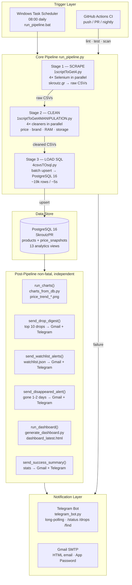

# Skroutz Price Tracker — Pipeline & DevOps Reference

## Architecture Overview



---

## File Structure

```
skroutz-data-pipeline/
│
├── run_pipeline.py              # Master orchestrator
├── run_pipeline.bat             # Task Scheduler launcher (update PYTHON path)
│
├── 1scriptToGet4.py             # Stage 1: parallel scraper launcher
├── 1scriptToGet4MANIPULATION.py # Stage 2: parallel cleaner launcher
├── 4csvsTOsql.py                # Stage 3: PostgreSQL upsert
│
├── skroutz_phonesWHILE.py       # Selenium scraper — phones
├── skroutz_laptopsWHILE.py      # Selenium scraper — laptops
├── skroutz_tabletsWHILE.py      # Selenium scraper — tablets
├── skroutz_SmartwatchesWHILE.py # Selenium scraper — smartwatches
│
├── Data_Phone.py                # Cleaner — phones
├── Data_Laptops.py              # Cleaner — laptops
├── Data_Tablets.py              # Cleaner — tablets
├── Data_Smartwatches.py         # Cleaner — smartwatches
│
├── charts_from_db.py            # Brand price-trend charts (PNG)
├── generate_dashboard.py        # Self-contained HTML dashboard
├── streamlit_app.py             # Interactive Streamlit dashboard
│
├── notifications.py             # Telegram notification layer
├── telegram_bot.py              # Interactive Telegram bot (long-polling)
├── db.py                        # SQLAlchemy engine singleton
│
├── analytics.sql                # 13 analytics views — run once against DB
├── watchlist.json               # Price alert targets [{url, label, threshold_eur}]
│
├── requirements.txt             # Python dependencies
├── docker-compose.yml           # Docker: Stage 2 + 3 only (SKIP_SCRAPE=1)
├── Dockerfile                   # Python image for Clean + Load
│
├── tests/
│   └── test_pipeline.py         # 49 unit tests (pytest)
│
├── .github/
│   └── workflows/
│       └── ci.yml               # GitHub Actions: lint · test · security scan
│
├── .env.example                 # Template — copy to .env, fill credentials
├── .gitignore
├── README.md
├── PIPELINE.md                  # This file
│
├── logs/                        # pipeline_YYYY-MM-DD.log · tg_sent_*.json (gitignored)
├── charts/                      # price_trend_*.png (tracked)
├── dashboard/                   # dashboard_latest.html (tracked)
│
├── Phones_skroutz/              # Raw CSVs — gitignored, regenerated daily
├── Laptops_skroutz/             # Raw CSVs — gitignored
├── Tablets_skroutz/             # Raw CSVs — gitignored
├── Smartwatches_skroutz/        # Raw CSVs — gitignored
└── Clean/                       # Cleaned CSVs — gitignored
```

---

## Environment Variables  (`.env`)

Copy `.env.example` → `.env` and fill in all values before running anything.

| Variable | Required | Description |
|---|---|---|
| `DB_HOST` | Yes | PostgreSQL host (e.g. `localhost`) |
| `DB_PORT` | Yes | PostgreSQL port (default `5432`) |
| `DB_NAME` | Yes | Database name (`SkroutzPR`) |
| `DB_USER` | Yes | DB username |
| `DB_PASSWORD` | Yes | DB password — special chars (`%`, `@`, `:`) handled by `URL.create()` in `db.py` |
| `ALERT_EMAIL` | Recommended | Gmail address for both `From:` and `To:` |
| `GMAIL_APP_PASSWORD` | Recommended | Gmail App Password (not your account password) |
| `TELEGRAM_BOT_TOKEN` | Optional | Bot token from `@BotFather` |
| `TELEGRAM_CHAT_ID` | Optional | Your numeric chat ID from `@userinfobot` |

> **Security:** `.env` is in `.gitignore` and must never be committed. If you accidentally expose credentials, rotate them immediately.

---

## Stage 1 — Scrape

**Script:** `1scriptToGet4.py`  
Launches 4 scrapers **in parallel** as subprocesses. Each runs in its own process to isolate Chrome instances and prevent one stuck scraper from blocking others.

| Scraper | Category | Output folder | Filename pattern |
|---|---|---|---|
| `skroutz_phonesWHILE.py` | phone | `Phones_skroutz/` | `skroutz_phones_YYYY-MM-DD.csv` |
| `skroutz_laptopsWHILE.py` | laptop | `Laptops_skroutz/` | `skroutz_laptos_YYYY-MM-DD.csv` |
| `skroutz_tabletsWHILE.py` | tablet | `Tablets_skroutz/` | `skroutz_tablets_YYYY-MM-DD.csv` |
| `skroutz_SmartwatchesWHILE.py` | smartwatch | `Smartwatches_skroutz/` | `skroutz_Smartwatches_YYYY-MM-DD.csv` |

Each scraper uses **`undetected-chromedriver`** to bypass skroutz bot-detection. `version_main` is auto-detected from the installed Chrome binary; falls back to `None` (auto-select) on failure.

Subprocess timeout: **2 hours** per scraper. On timeout the process is killed and the handle reaped.

> **Docker/CI constraint:** Scrapers CANNOT run in Docker or CI — Skroutz bot-detection blocks headless Chrome.  
> Set `SKIP_SCRAPE=1` to bypass Stage 1 (done automatically in `docker-compose.yml` and GitHub Actions).

---

## Stage 2 — Clean

**Script:** `1scriptToGet4MANIPULATION.py`  
Launches 4 cleaners in parallel, each reading the latest raw CSV for its category.

| Cleaner | Input | Output |
|---|---|---|
| `Data_Phone.py` | `Phones_skroutz/*.csv` | `Clean/Phones_skroutz_clean/clean_YYYY-MM-DD.csv` |
| `Data_Laptops.py` | `Laptops_skroutz/*.csv` | `Clean/Laptops_skroutz_clean/clean_YYYY-MM-DD.csv` |
| `Data_Tablets.py` | `Tablets_skroutz/*.csv` | `Clean/Tablets_skroutz_clean/clean_YYYY-MM-DD.csv` |
| `Data_Smartwatches.py` | `Smartwatches_skroutz/*.csv` | `Clean/Smartwatches_skroutz_clean/clean_YYYY-MM-DD.csv` |

**Operations per cleaner:**
- Price normalisation — strips `€`, handles Greek decimal commas, price ranges
- Brand / model / color extraction (regex + lookup tables)
- RAM / storage parsing (`"8/128GB"` → `ram_gb=8`, `storage_gb=128`)
- Camera count, display size, battery info extraction
- Deduplication within the daily file

---

## Stage 3 — Load SQL

**Script:** `4csvsTOsql.py`  
Reads all 4 cleaned CSVs and **upserts** into PostgreSQL using SQLAlchemy.

- **`products`**: INSERT on first-seen URL; UPDATE `last_seen` every run
- **`price_snapshots`**: `ON CONFLICT (product_id, date) DO NOTHING` — fully re-run safe
- **Batch upsert:** `executemany` (~20 total queries across all 4 categories vs row-by-row)  
  ~19k products + ~19k snapshots in ~3–5s wall time
- Rows with missing or `"N/A"` links are skipped before any DB interaction

---

## Database Schema

```
products
─────────────────────────────────────────────────────
 id              SERIAL PRIMARY KEY
 category        VARCHAR(20)       'phone'|'laptop'|'tablet'|'smartwatch'
 skroutz_link    TEXT  UNIQUE      canonical URL — natural key
 product_name    TEXT
 brand           VARCHAR(100)
 model           TEXT
 specs           TEXT
 ram_gb          INTEGER
 storage_gb      INTEGER
 num_cameras     INTEGER
 camera_type     VARCHAR(50)
 display_inches  NUMERIC(4,1)
 battery_info    VARCHAR(50)
 display_info    TEXT
 color           VARCHAR(100)
 first_seen      DATE
 last_seen       DATE

price_snapshots
─────────────────────────────────────────────────────
 id                      SERIAL PRIMARY KEY
 product_id              INTEGER  → products.id
 date                    DATE
 price_eur               NUMERIC(10,2)
 installments_per_month  NUMERIC(8,2)
 installments_in_total   NUMERIC(8,2)
 rating                  NUMERIC(3,1)
 reviews                 INTEGER
 UNIQUE (product_id, date)

Indexes
─────────────────────────────────────────────────────
 idx_price_snapshots_product_date  (product_id, date)
 idx_price_snapshots_date          (date)
 idx_products_brand                (brand)
 idx_products_category             (category)
 idx_products_last_seen            (last_seen)
```

**Scale:** ~19,600 products · ~146,000+ snapshots · ~19,000 new rows/day  
**Projection:** `price_snapshots` reaches ~100M rows in ~14 years at current growth rate.

---

## Analytics Views  (`analytics.sql` — run once against DB)

| View | Purpose |
|---|---|
| `vw_latest_prices` | Most recent price + metadata per product |
| `vw_price_history` | Full daily history with LAG-based day-over-day delta |
| `vw_biggest_drops` | All negative price changes ordered by size |
| `vw_brand_summary` | Min/max/avg/median price per brand per category |
| `vw_disappeared` | Products not seen for 7+ days |
| `vw_price_volatility` | 30-day coefficient of variation (stddev / avg) |
| `vw_brand_price_trend` | Daily avg price per brand/category (for charts) |
| `vw_hot_deals` | Price drop AND review surge vs. previous scrape |
| `vw_price_floor` | All-time low + high per product |
| `vw_brand_discount_freq` | % of days each brand had ≥3% drop (last 90 days) |
| `vw_near_atl` | Products within N% of their all-time low |
| `vw_price_trend_direction` | 7-day vs 30-day avg → falling / stable / rising |
| `vw_daily_market_index` | Daily avg/min/max price per category (macro trend) |

```sql
-- Sample: cheapest phones near their all-time low
SELECT product_name, brand, price_eur, all_time_low, pct_above_atl
FROM vw_near_atl
WHERE category = 'phone' AND pct_above_atl <= 5
ORDER BY pct_above_atl;
```

---

## Notification Layer

### Telegram  (`notifications.py`)
HTML-formatted messages via Bot API. Deduplicates per-day via `logs/tg_sent_YYYY-MM-DD.json`.  
Failed sends use **exponential backoff** (5s → 10s → 20s … capped at 300s).

| Function | Trigger |
|---|---|
| `tg_pipeline_start()` | Pipeline begins |
| `tg_failure(stage, code, log)` | Any core stage fails |
| `tg_drops(rows)` | Top 10 price drops today |
| `tg_watchlist(hits)` | Watchlist threshold crossed |
| `tg_disappeared(rows)` | Products gone 1–2 days |
| `tg_success(snaps, new, drops, elapsed)` | Pipeline complete |

### Gmail  (`run_pipeline.py`)
HTML email via SMTP with 30-second connection timeout. `html.escape()` applied to all DB-sourced strings before insertion into email HTML.

| Function | Subject | Trigger |
|---|---|---|
| `send_failure_alert(stage, code)` | `[Skroutz Pipeline] FAILED — {stage}` | Core stage failure |
| `send_drop_digest()` | `[Skroutz] N price drops today` | Top 10 from `vw_biggest_drops` |
| `send_watchlist_alerts()` | `[Skroutz] N price target(s) reached` | `watchlist.json` hits |
| `send_disappeared_alert()` | `[Skroutz] N product(s) disappeared` | `last_seen` 1–2 days ago |
| `send_success_summary(elapsed)` | `[Skroutz] Pipeline OK` | All stages passed |

`send_success_summary()` logs a **WARNING** if today's snapshot count is < 50% of yesterday's (partial scrape anomaly detection).

---

## Interactive Telegram Bot  (`telegram_bot.py`)

Long-polling bot — run as a **separate persistent process**, not part of the daily pipeline.  
`watchlist.json` writes are atomic (`os.replace`) — crash-safe.

| Command | Action |
|---|---|
| `/status` | Latest pipeline run status + timestamp |
| `/drops` | Top price drops from today's scrape |
| `/watchlist` | List current watchlist items |
| `/add <url>` | Conversation flow: URL → label → threshold |
| `/remove <n>` | Remove watchlist item by index |
| `/find <query>` | Full-text product search by name/brand |
| `/stats` | DB totals: products, snapshots, categories |

---

## CI/CD  (GitHub Actions)

The CI pipeline runs on every push and pull request. It **cannot** run the Selenium scrapers — it validates code quality and runs the unit test suite only.

**`.github/workflows/ci.yml`**

```yaml
name: CI

on:
  push:
    branches: ["main"]
  pull_request:
    branches: ["main"]
  schedule:
    - cron: "0 6 * * *"   # nightly health check

jobs:
  lint-and-test:
    runs-on: ubuntu-latest
    steps:
      - uses: actions/checkout@v4

      - uses: actions/setup-python@v5
        with:
          python-version: "3.11"
          cache: "pip"

      - name: Install dependencies
        run: pip install -r requirements.txt pytest ruff

      - name: Lint (ruff)
        run: ruff check .

      - name: Unit tests
        run: pytest tests/ -v --tb=short

  security-scan:
    runs-on: ubuntu-latest
    steps:
      - uses: actions/checkout@v4

      - name: Dependency vulnerability scan (pip-audit)
        run: |
          pip install pip-audit
          pip-audit -r requirements.txt

      - name: Secret detection (truffleHog)
        uses: trufflesecurity/trufflehog@main
        with:
          path: ./
          base: ${{ github.event.repository.default_branch }}
          head: HEAD
          extra_args: --only-verified
```

**What CI checks:**
- **Ruff** — linting and code style (replaces flake8 + isort + pyupgrade)
- **pytest** — 49 unit tests covering price parsing, DB coercions, notifications, watchlist I/O
- **pip-audit** — CVE scan of all pinned dependencies in `requirements.txt`
- **TruffleHog** — scans commits for accidentally committed secrets

**What CI does NOT do** (by design):
- Run scrapers (Selenium + real browser required)
- Run integration tests against PostgreSQL (no live DB in CI)
- Deploy (pipeline runs on Windows Task Scheduler, not a cloud deployment target)

---

## Docker  (Clean + Load only)

Scrapers require a real Chrome browser with human-like behavior — they cannot run in Docker.  
Docker is used only for **Stage 2 (Clean) + Stage 3 (Load SQL)** when raw CSVs already exist.

```
# 1. Run scrapers on Windows first (produces raw CSVs)
& "C:\Users\StavrosKV\anaconda33\python.exe" 1scriptToGet4.py

# 2. Run Clean + Load in Docker
docker compose up --build
```

`docker-compose.yml` sets `SKIP_SCRAPE=1` automatically so Stage 1 is bypassed.  
The `Clean/` and `*_skroutz/` folders are bind-mounted so the container reads raw CSVs and writes back to the host.

---

## Failure Behaviour & Rollback

```
Core stage fails (non-zero exit code)
         │
         ├─► send_failure_alert()   Gmail + Telegram
         │
         └─► sys.exit()             pipeline aborts immediately
                                    no downstream stage runs
                                    DB is in last-good state
```

Post-pipeline steps (charts, emails, dashboard) are **non-fatal** — failure is logged as a WARNING and the pipeline continues.

**Recovery procedure:**
1. Check `logs/pipeline_YYYY-MM-DD.log` for the error
2. Fix the root cause
3. Re-run `run_pipeline.py` manually — the `ON CONFLICT DO NOTHING` constraint makes every re-run idempotent; no duplicate rows are created

**No rollback needed:** because Stage 3 uses `ON CONFLICT DO NOTHING`, a partial run cannot corrupt the database. The worst case is a day with fewer snapshots than expected, which is caught by the 50% anomaly check in `send_success_summary()`.

---

## Automation  (Windows Task Scheduler)

```
Task Scheduler
  └─► run_pipeline.bat  (08:00 daily)
        └─► C:\Users\StavrosKV\anaconda33\python.exe run_pipeline.py
```

**To register the scheduled task (run once as Administrator):**

```powershell
$action  = New-ScheduledTaskAction -Execute "C:\Users\StavrosKV\Documents\Projects\ProjectsPY\run_pipeline.bat"
$trigger = New-ScheduledTaskTrigger -Daily -At "08:00"
$settings = New-ScheduledTaskSettingsSet -ExecutionTimeLimit (New-TimeSpan -Hours 4)
Register-ScheduledTask -TaskName "SkroutzPipeline" -Action $action -Trigger $trigger -Settings $settings -RunLevel Highest
```

---

## Observability

| Signal | Source | Retention |
|---|---|---|
| Pipeline log | `logs/pipeline_YYYY-MM-DD.log` | 30 days (auto-rotated by `_cleanup_old_logs()`) |
| Scraper logs (dated) | `logs/skroutz_*WHILE_YYYY-MM-DD.log` | 30 days |
| Scraper logs (current run) | `scraper_{phones,laptops,tablets,smartwatches}.log` | Overwritten each run (`mode="w"`) |
| Telegram dedup records | `logs/tg_sent_YYYY-MM-DD.json` | 30 days |
| Anomaly detection | `send_success_summary()` — warns if today < 50% of yesterday | Logged + emailed |
| Stage timing | `=== Stage complete in Xs ===` log lines | Per run |

**Key metrics to watch:**
- Today's snapshot count vs yesterday (`price_snapshots WHERE date = CURRENT_DATE`)
- Stage elapsed time — scrape typically 45–90 min; clean + load typically < 2 min
- Telegram dedup file size — grows with notification volume

---

## Testing

```powershell
# Run all tests
& "C:\Users\StavrosKV\anaconda33\python.exe" -m pytest tests/ -v

# Run with coverage
& "C:\Users\StavrosKV\anaconda33\python.exe" -m pytest tests/ --cov=. --cov-report=term-missing
```

**Test coverage (49 tests):**

| Class | Tests | What it covers |
|---|---|---|
| `TestCleanPrice` | 10 | Greek price format normalisation (scraper pre-processed: dots as thousands separator) |
| `TestExtractRamStorage` | 8 | RAM/storage pattern variants (`8/128GB`, `8GB/256`, `16 GB`, `0.5TB`) |
| `TestLoaderHelpers` | 12 | `_val` / `_int` / `_float` coercions — None, N/A, edge cases |
| `TestNotificationsDedup` | 6 | Dedup file read/write/reset cycle |
| `TestWatchlistAtomicWrite` | 7 | `os.replace()` roundtrip, corrupted-file safety |
| `TestNALinkGuard` | 6 | Invalid link detection (N/A, empty, whitespace) |

All tests are pure unit tests — no database, no Chrome, no network. Safe to run in CI.

---

## Security Checklist

| Control | Implementation |
|---|---|
| Credentials isolation | `.env` only; parsed by `python-dotenv`; `.gitignore`d |
| DB connection | `URL.create()` handles special chars in password; `pool_pre_ping=True` |
| HTML injection | `html.escape()` on all DB-sourced strings in email templates |
| Atomic file writes | `os.replace()` for `watchlist.json` and `dashboard_latest.html` |
| Dependency CVEs | `pip-audit` in CI on every push |
| Secret scanning | TruffleHog in CI on every push |
| Bot-detection evasion | `undetected-chromedriver` (no headless flag — skroutz detects it) |
| Log rotation | 30-day auto-cleanup prevents unbounded log growth |

---

## How to Extend

### Add a new product category

1. Write a new scraper `skroutz_<category>WHILE.py` — copy `skroutz_SmartwatchesWHILE.py` as template
2. Write a new cleaner `Data_<Category>.py` — copy `Data_Smartwatches.py` as template
3. Register both in `1scriptToGet4.py` and `1scriptToGet4MANIPULATION.py`
4. Add the category string to `CATEGORIES` in `charts_from_db.py`
5. Add the new output folder to `.gitignore` and `docker-compose.yml` bind mounts

### Add a new analytics view

1. Write the SQL `CREATE OR REPLACE VIEW vw_<name> AS ...` in `analytics.sql`
2. Run `analytics.sql` against the live DB once
3. Reference the view in `run_pipeline.py`, `streamlit_app.py`, or `generate_dashboard.py`

### Add a new Telegram bot command

1. Add a handler function in `telegram_bot.py`
2. Register it in the command dispatch map
3. Add the corresponding notification function to `notifications.py` if it sends proactive messages

### Change the scrape schedule

Edit the Windows Task Scheduler trigger time, or update the `cron:` schedule in `.github/workflows/ci.yml` for the nightly CI run.

---

## Outputs

| Artifact | Path | Notes |
|---|---|---|
| Raw CSVs | `Phones_skroutz/` etc. | Stage 1; gitignored; regenerated daily |
| Cleaned CSVs | `Clean/` | Stage 2; gitignored |
| Price charts (PNG) | `charts/price_trend_{phone,laptop,smartwatch,tablet}.png` | Tracked in git |
| HTML dashboard | `dashboard/dashboard_latest.html` | Tracked; dated copies gitignored |
| Streamlit dashboard | `http://localhost:8501` | `streamlit run streamlit_app.py` |
| Pipeline log | `logs/pipeline_YYYY-MM-DD.log` | Rotated at 30 days |
| Scraper logs (root) | `scraper_*.log` | Overwritten each run |
| Scraper logs (dated) | `logs/skroutz_*WHILE_YYYY-MM-DD.log` | Rotated at 30 days |
| Telegram dedup | `logs/tg_sent_YYYY-MM-DD.json` | Rotated at 30 days |

---

## Next Steps & Recommendations

### High priority

| Item | Why | Effort |
|---|---|---|
| **Run `analytics.sql` against live DB** | Creates `vw_near_atl`, `vw_price_trend_direction`, `vw_daily_market_index` — required for new dashboard features | 2 min |
| **Add `.github/workflows/ci.yml`** | Automates lint + test + CVE scan on every push; catches regressions before they hit production | 1 hour |
| **Integration test against a test DB** | Unit tests cover parsing logic; no test currently catches schema drift or SQL errors | Half day |

### Medium priority

| Item | Why | Effort |
|---|---|---|
| **`ruff` linting config** (`ruff.toml`) | Enforces consistent style across all scripts; zero-config option available | 30 min |
| **Streamlit auth** | Dashboard is currently unauthenticated if served externally | 1 hour |
| **Partition `price_snapshots` by month** | At 19k rows/day the table reaches 100M rows in ~14 years; partitioning keeps vacuums fast | Half day |
| **Retry logic in Stage 1 launcher** | If one scraper fails, the others still succeed; re-running the failed scraper alone would avoid a full re-scrape | Half day |

### Low priority / future

| Item | Why |
|---|---|
| **Airflow / Prefect DAG** | Replaces Task Scheduler with a proper scheduler UI, dependency graph, retries, and history |
| **Grafana + Prometheus metrics** | Expose pipeline run time, snapshot count, error rate as time-series metrics |
| **Price change webhook** | Push drop events to a REST endpoint for third-party integrations |
| **Multi-user watchlist** | Telegram bot currently uses a single `watchlist.json`; per-user lists require a DB table |
