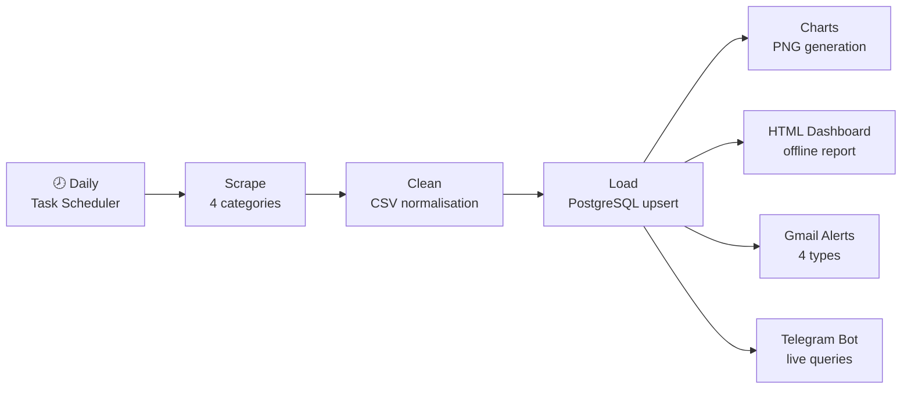
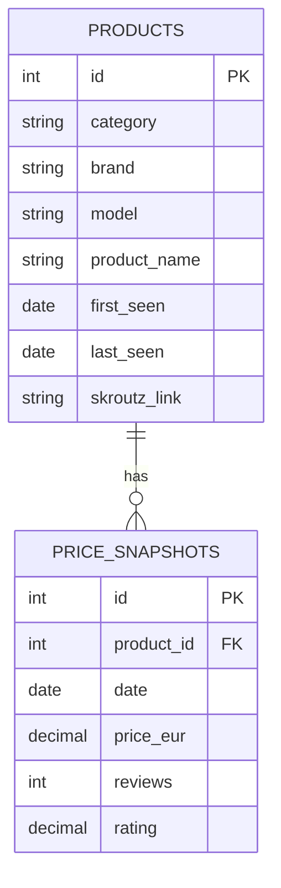

# Skroutz Price Tracker

<!-- STATS:BADGES:START -->


<!-- STATS:BADGES:END -->


[](https://stavroskav.github.io/skroutz-data-pipeline/)

**🔴 Live dashboard: [stavroskav.github.io/skroutz-data-pipeline](https://stavroskav.github.io/skroutz-data-pipeline/)** — regenerated and published automatically after every daily run.

A production ETL pipeline tracking every phone, laptop, tablet, and smartwatch on [Skroutz.gr](https://www.skroutz.gr) — Greece's largest e-commerce aggregator. Launched June 2025 and running as a fully unattended daily job: **459,000+ price snapshots of 21,500+ products** in PostgreSQL, served through email/Telegram alerting, an interactive bot, and two dashboards — with zero manual intervention between runs.

**📊 Read the data story: [What 460,000 snapshots reveal about Greek electronics pricing →](docs/INSIGHTS.md)** — catalog churn, brand discount culture, and how many "sale" prices are actually a new low.

---

## What This Project Does

Every morning at 08:00 the pipeline scrapes ~7,000 live listings across four categories, cleans and upserts them into PostgreSQL, refreshes 10 materialized analytics views, regenerates charts and a self-contained HTML dashboard, rewrites this README's stats, and sends the day's price-drop digest and watchlist alerts over Gmail and Telegram. If anything breaks — a scraper, the load, even the Python interpreter itself — an alert fires before a data gap can go unnoticed.

---

## Pipeline Architecture



`run_pipeline.py` drives all three stages sequentially. **Stage 1** launches four Selenium scrapers in parallel (staggered 13 s apart) using `undetected-chromedriver`. **Stage 2** runs four per-category cleaners in parallel, normalising Greek number formats, extracting brand/model/specs via regex, and parsing installment data. **Stage 3** upserts every cleaned row into PostgreSQL — new products are inserted, existing ones get their price snapshot appended. Any non-zero exit aborts the run and fires a Gmail failure alert immediately — data gaps are never silent.

---

## Engineering Highlights

- **Observer-stage design** — everything downstream of Load (charts, alerts, dashboards, README stats) runs as a non-fatal *observer* stage: it can fail without aborting the run or corrupting data, and the contract is pinned by tests ([run_pipeline.py](run_pipeline.py), [tests/test_smoke.py](tests/test_smoke.py)).
- **Markup-drift guard** — every scrape is validated against per-field completeness thresholds before its CSV is written, so a Skroutz redesign fails loudly instead of silently loading garbage ([scraper_core.py](scraper_core.py)); a fixture test parses saved real listing HTML as an early-warning canary ([tests/test_pipeline.py](tests/test_pipeline.py)).
- **Alerting below the application layer** — Task Scheduler launches a PowerShell wrapper that fires a Telegram alert even when Python itself cannot start (broken interpreter, import crash) ([run_pipeline_wrapper.ps1](run_pipeline_wrapper.ps1)).
- **Idempotent, re-run-safe loads** — `UNIQUE(product_id, date)` plus upserts make every stage safely repeatable; a stale-aware lock file blocks concurrent runs.
- **Materialized analytics** — 10 of the 15 SQL views are materialized and refreshed `CONCURRENTLY` after each load; pg_trgm trigram indexes make leading-wildcard product search instant for the Telegram bot ([analytics.sql](analytics.sql)).
- **CI on every push** — ruff lint, pytest suite, pip-audit dependency scan, and TruffleHog secret scan, plus a nightly scheduled run ([ci.yml](.github/workflows/ci.yml)).

---

## Database Schema



`UNIQUE(product_id, date)` on `price_snapshots` makes the pipeline re-run safe.

---

## Live Market Snapshot

<!-- STATS:TABLE:START -->
| Category | Products | Snapshots | Avg Price | Range | Brands |
|---|---|---|---|---|---|
| Laptop | 7,777 | 156,289 | €1,602 | €52–€10,760 | 46 |
| Phone | 5,689 | 99,480 | €335 | €9–€3,839 | 129 |
| Smartwatch | 6,282 | 184,865 | €90 | €5–€3,399 | — |
| Tablet | 1,771 | 32,585 | €538 | €33–€6,091 | 98 |
| **Total** | **21,519** | **473,219** | | | |

Updated daily via Task Scheduler · last pipeline run: 2026-07-20
<!-- STATS:TABLE:END -->

---

## Price Trend Charts

Daily price history for the top 6 most-reviewed products per category, generated by `charts_from_db.py` — dark-themed PNGs regenerated after every pipeline run.

**Phones — top 6 by reviews**


**Laptops — top 6 by reviews**


**Smartwatches — top 6 by reviews**


**Tablets — top 6 by reviews**


---

## Sample Insights

Live samples from the analytics views — the full analysis with charts and methodology is in **[docs/INSIGHTS.md](docs/INSIGHTS.md)**.

### Biggest Price Drops — Last 30 Days

| Brand | Model | Category | Was € | Now € | Saved € | Drop % |
|---|---|---|---|---|---|---|
| Dell | AW18 18" (i7-13620H/64GB/2TB) | Laptop | 10,358 | 7,470 | 2,888 | -27.9% |
| HP | EliteBook X G2i 14" (Ultra 7-358H/32GB/1TB) | Laptop | 5,366 | 2,675 | 2,691 | -50.2% |
| Dell | Alienware M18 R2 14" (U-Series-7-258V/32GB/1TB) | Laptop | 8,712 | 6,227 | 2,485 | -28.5% |
| Lenovo | ThinkPad P16 Gen 3 16" (Ultra 7-265HX/64GB/1TB) | Laptop | 7,970 | 5,549 | 2,422 | -30.4% |
| ThinkPad | X1 2-in-1 Gen 10 14" (Ultra 7-255U/32GB/1TB) | Laptop | 7,075 | 4,737 | 2,338 | -33.0% |

### Near All-Time Low (within 3%)

| Brand | Model | Category | Current € | ATL € | Above ATL |
|---|---|---|---|---|---|
| Ulefone | Armor 7 Dual SIM (8/128GB) | Phone | 174.63 | 174.63 | 0.0% |
| Samsung | Galaxy S10 Dual SIM (8/128GB) | Phone | 639.90 | 639.90 | 0.0% |
| Huawei | P30 Dual SIM (6/128GB) | Phone | 598.99 | 598.99 | 0.0% |
| Huawei | Mate 20 Dual SIM (4/128GB) | Phone | 389.00 | 389.00 | 0.0% |
| Panasonic | KX-TU400 Single SIM | Phone | 52.64 | 52.64 | 0.0% |

These products are within 3% of their lowest ever recorded price.

### Most Price-Volatile Products (30 days)

| Brand | Model | Category | Volatility (CV%) |
|---|---|---|---|
| Samsung | Galaxy S24 FE Enterprise Edition 5G (8/128GB) Graphite | Phone | 51.4% |
| Emporia | TALKglam Dual SIM | Phone | 43.2% |
| Celly | TRAINERBEAT | Smartwatch | 43.1% |
| MyPhone | CareWatch LTE 42mm | Smartwatch | 38.3% |
| Asus | ProArt P16 16" (Ryzen AI 9 HX 370/64GB/2TB) | Laptop | 36.7% |

CV% = coefficient of variation — higher means price swings more.

---

## Analytics Views

15 SQL views power the dashboards, alerts, and Telegram bot. Run `analytics.sql` once to create them all.

| View | What it answers |
|---|---|
| `vw_latest_prices` | Current price, rating, and snapshot date for every product |
| `vw_price_history` | Full daily price history with day-over-day change (LAG) |
| `vw_biggest_drops` | Largest single-day absolute price drops across all time |
| `vw_brand_summary` | Avg / median / min / max price per brand per category |
| `vw_disappeared` | Products not seen for 7+ days — likely delisted |
| `vw_price_volatility` | 30-day coefficient of variation per product |
| `vw_brand_price_trend` | Daily avg price per brand/category for trend comparison |
| `vw_hot_deals` | Price drop + review surge since the previous scrape |
| `vw_price_floor` | All-time low and high per product |
| `vw_brand_discount_freq` | % of days each brand had a ≥3% drop (last 90 days) |
| `vw_near_atl` | Products currently within a given % of their all-time low |
| `vw_price_trend_direction` | 7-day vs 30-day avg momentum — falling / stable / rising |
| `vw_daily_market_index` | Daily avg category price — macro market trend |
| `vw_restock_pricing` | Price before vs. after a 3+ day stock gap |
| `vw_review_velocity` | Products gaining the most new reviews in the last 14 days |

---

## Alerts & Notifications

| Alert | Trigger | Channel |
|---|---|---|
| Daily price drop digest | Top 10 drops each day | Gmail |
| Watchlist threshold hit | Product ≤ target price | Gmail + Telegram |
| Disappeared product | Not seen for 1–2 days | Gmail + Telegram |
| Pipeline success summary | After every successful run | Gmail + Telegram |
| Pipeline failure | Any stage exits non-zero | Gmail + Telegram |

Configure `ALERT_EMAIL` and `GMAIL_APP_PASSWORD` (a Gmail App Password, not your account password) in `.env`. Watchlist targets live in `watchlist.json` — use `watchlist.example.json` as a schema reference.

---

## Telegram Bot Commands

| Command | What it returns |
|---|---|
| `/status` | Last pipeline run result |
| `/drops [category]` | Today's top 10 price drops |
| `/best [category]` | Products closest to all-time low |
| `/find <name>` | Search product + ATL context |
| `/history <name>` | 14-day price timeline |
| `/watchlist` | Live prices for your watchlist |
| `/add <url> <€>` | Add product to watchlist |
| `/remove <n>` | Remove item from watchlist |
| `/restock` | Products back after stock gap |
| `/stats` | DB counts |
| `/help` | All commands |

Send any Skroutz.gr URL directly to the bot and it guides you through adding it to the watchlist interactively.

---

## Running the Project

**1. Install dependencies**

```powershell
& ".venv\Scripts\python.exe" -m pip install -r requirements.txt
```

**2. Configure credentials**

```powershell
Copy-Item .env.example .env   # then fill in DB_*, ALERT_EMAIL, GMAIL_APP_PASSWORD, TELEGRAM_BOT_TOKEN, TELEGRAM_CHAT_ID
```

**3. Create the schema and analytics views (once, on a fresh database)**

```powershell
psql -U postgres -d SkroutzPR -f create_new_schema.sql
psql -U postgres -d SkroutzPR -f analytics.sql
```

**4. Full pipeline**

```powershell
& ".venv\Scripts\python.exe" run_pipeline.py
```

**5. Streamlit dashboard** (separate terminal — runs until stopped)

```powershell
& ".venv\Scripts\python.exe" -m streamlit run streamlit_app.py
# Opens at http://localhost:8501
```

**6. Telegram bot** (separate terminal — runs until stopped)

```powershell
& ".venv\Scripts\python.exe" telegram_bot.py
```

**7. Tests and lint**

```powershell
& ".venv\Scripts\python.exe" -m pytest tests/ -v
& ".venv\Scripts\python.exe" -m ruff check .
```

**Docker (Clean + Load only):** The scrapers require a real Chrome window — Skroutz bot-detection blocks headless Chrome. Run Stage 1 on Windows first, then `docker compose up --build` for stages 2 and 3 (`SKIP_SCRAPE=1` is set automatically in `docker-compose.yml`).

---

## Tech Stack

| Layer | Technology |
|---|---|
| Scraping | Python · Selenium · undetected-chromedriver |
| Data processing | pandas · numpy |
| Database | PostgreSQL 16 · SQLAlchemy 2.x |
| Analytics | 15 SQL views · window functions |
| Dashboards | Streamlit · Chart.js · Plotly |
| Alerts | Gmail SMTP · Telegram Bot API |
| Infrastructure | Docker · Windows Task Scheduler |
| Quality | pytest · ruff |

---

> This project is for personal learning and portfolio purposes. No scraped data is stored in this repository — all CSVs are excluded via `.gitignore`. The scraper accesses only publicly visible listing pages and makes no attempt to bypass authentication or access private data.
