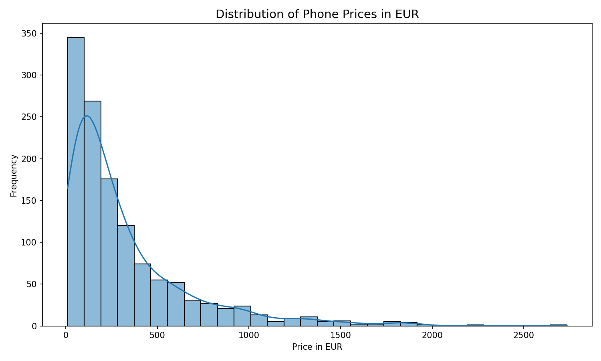
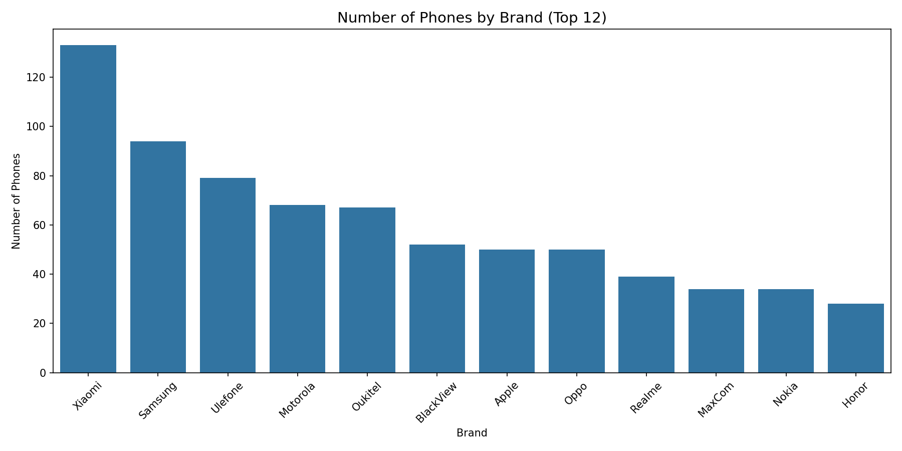
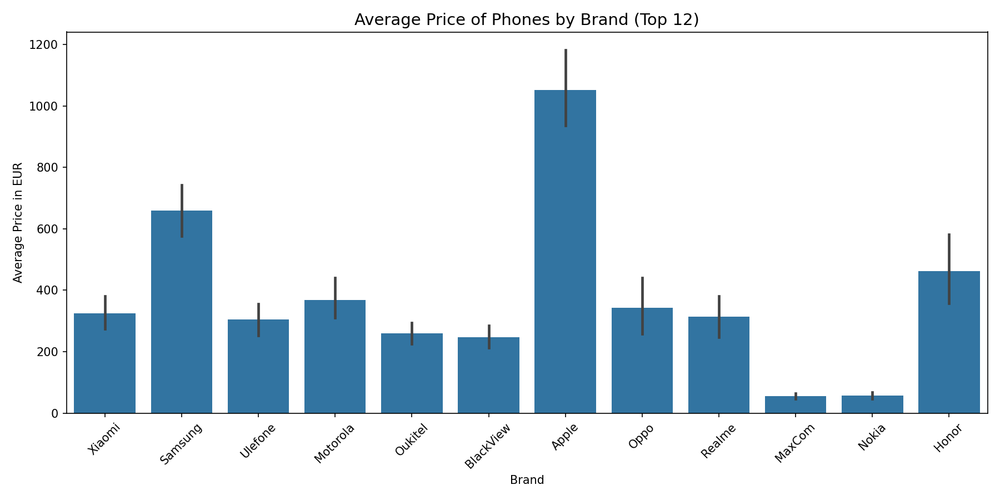

# Skroutz Price Tracker


An end-to-end Python data engineering pipeline that scrapes daily product listings from [Skroutz.gr](https://www.skroutz.gr) (Greece's largest e-commerce aggregator), cleans and enriches the data, and stores it in a normalized PostgreSQL database for long-term price trend analysis.

**19,607 products tracked · 146,405 price snapshots · 4 categories · daily since June 2025**

---

## Architecture

```
Scrapers (x4) --> raw CSVs --> Cleaners (x4) --> clean CSVs --> PostgreSQL loader
     |                                                                   |
Selenium +                                                        products table
undetected-                                                     + price_snapshots
chromedriver                                                          table
```

`run_pipeline.py` orchestrates all three stages sequentially. If any stage fails, the pipeline aborts and sends a Gmail alert so data gaps are never silent. Automated daily at **08:00** via Windows Task Scheduler.

### Stage 1 — Scrape (`1scriptToGet4.py`)
Launches 4 Selenium scrapers in parallel (phones, laptops, smartwatches, tablets). Uses `undetected-chromedriver` to bypass bot detection. Saves raw CSVs to category folders.

### Stage 2 — Clean (`1scriptToGet4MANIPULATION.py`)
Applies per-category transformations:
- Greek number format → float (`1.100,00 €` → `1100.0`)
- Brand / model extraction via regex with fallback patterns
- Installment parsing (`44,10 €/μήνα σε 24 δόσεις` → monthly=44.10, total=24)

### Stage 3 — Load (`4csvsTOsql.py`)
Upserts into PostgreSQL using `ON CONFLICT`:
- `products` — static metadata inserted once; only `last_seen` updated on re-scrape
- `price_snapshots` — one row per product per day; safe to re-run (DO NOTHING on duplicate)

---

## Database Schema

Two-table normalized design separating static product metadata from daily price observations:

```sql
products (
    id            SERIAL PRIMARY KEY,
    category      TEXT,          -- phone | laptop | smartwatch | tablet
    skroutz_link  TEXT UNIQUE,   -- natural key used for upserts
    product_name  TEXT,
    brand         TEXT,
    model         TEXT,
    specs         TEXT,
    -- phone-specific: ram_gb, storage_gb, num_cameras, display_inches, ...
    first_seen    DATE,
    last_seen     DATE
)

price_snapshots (
    id                     SERIAL PRIMARY KEY,
    product_id             INTEGER REFERENCES products(id),
    date                   DATE,
    price_eur              NUMERIC,
    installments_per_month NUMERIC,
    installments_in_total  NUMERIC,
    rating                 NUMERIC,
    reviews                INTEGER,
    UNIQUE (product_id, date)
)
```

Static metadata is stored once; price history grows by ~19k rows per day.

---

## Tech Stack

| Layer | Tools |
|---|---|
| Scraping | Python 3.13, Selenium 4.41, undetected-chromedriver 3.5 |
| Processing | pandas 2.3, numpy 2.3, re |
| Database | PostgreSQL, SQLAlchemy 2.0, psycopg2 2.9 |
| Orchestration | subprocess, Windows Task Scheduler |
| Alerting | smtplib (Gmail SMTP) |
| Containerisation | Docker |
| Visualisation | matplotlib 3.10, seaborn 0.13 |

---

## Setup

### 1. Install dependencies
```bash
pip install -r requirements.txt
```

### 2. Configure credentials
```bash
cp .env.example .env
# Edit .env — add your PostgreSQL password and optionally a Gmail App Password for alerts
```

### 3. Create the database schema
Run `create_new_schema.sql` against your PostgreSQL instance in pgAdmin or psql.

### 4. Run the pipeline
```bash
python run_pipeline.py
```

### 5. Run with Docker (optional)
Spins up PostgreSQL + the pipeline in one command — no local Postgres install needed:
```bash
cp .env.example .env   # fill in DB_PASSWORD (other DB vars have sensible defaults)
docker compose up --build
```
The schema is applied automatically on first run via the `initdb` mount.

> **Note:** The scrapers open a real Chrome window and cannot run headless (skroutz bot-detection).
> Docker is most useful for running only the Clean + Load stages against CSVs you already have.

### 6. Automate (Windows Task Scheduler)
Edit `run_pipeline.bat` and update the `PYTHON` path to your interpreter, then register:
```
schtasks /create /tn "SkroutzDailyPipeline" /tr "C:\path\to\run_pipeline.bat" /sc DAILY /st 08:00 /f
```

---

## Project Structure

```
├── run_pipeline.py               # Master orchestrator (scrape -> clean -> load)
├── 1scriptToGet4.py              # Stage 1: parallel scraper launcher
├── 1scriptToGet4MANIPULATION.py  # Stage 2: parallel cleaner launcher
├── 4csvsTOsql.py                 # Stage 3: PostgreSQL loader (upserts)
│
├── skroutz_phonesWHILE.py        # Selenium scraper — phones
├── skroutz_laptopsWHILE.py       # Selenium scraper — laptops
├── skroutz_SmartwatchesWHILE.py  # Selenium scraper — smartwatches
├── skroutz_tabletsWHILE.py       # Selenium scraper — tablets
│
├── Data_Phone.py                 # Cleaner — phones
├── Data_Laptops.py               # Cleaner — laptops
├── Data_Smartwatches.py          # Cleaner — smartwatches
├── Data_Tablets.py               # Cleaner — tablets
│
├── migrate_data.py               # One-time: flat tables -> normalized schema
├── backfill_models.py            # One-time: backfill brand/model from product names
├── Skroutz_data_EDA.py           # Exploratory data analysis & visualizations
├── charts_from_db.py             # Multi-day price trend charts from PostgreSQL
├── analytics.sql                 # Five analytical views (run once in DB)
│
├── Dockerfile
├── requirements.txt
├── run_pipeline.bat              # Task Scheduler launcher (update PYTHON path)
└── .env.example                  # Credential template — copy to .env
```

---

## Sample Output

After the clean stage, each row in the phones CSV looks like this:

| Brand | Model | RAM | Storage | Price (€) | Rating | Reviews | Date |
|---|---|---|---|---|---|---|---|
| Xiaomi | Redmi Note 14 Pro 5G | 8 GB | 256 GB | 256.63 | 4.7 | 133 | 2025-06-13 |
| Xiaomi | Redmi 14C NFC | 8 GB | 256 GB | 107.82 | 4.6 | 176 | 2025-06-13 |
| Apple | iPhone 16 Pro Max | 8 GB | 256 GB | 1352.00 | 4.7 | 165 | 2025-06-13 |
| Samsung | Galaxy A55 5G | 8 GB | 128 GB | 332.99 | 4.7 | 1139 | 2025-06-13 |

Each row becomes one `price_snapshots` record in PostgreSQL, linked to its `products` entry by foreign key. Running the pipeline daily appends ~19k new rows.

---

## Data Coverage (May 2026)

| Category | Products | Snapshots | Model Coverage |
|---|---|---|---|
| Phones | 5,265 | 44,307 | 100% |
| Laptops | 6,320 | 55,744 | 100% |
| Smartwatches | 6,244 | 35,031 | 95% |
| Tablets | 1,778 | 11,323 | 100% |
| **Total** | **19,607** | **146,405** | — |

---

## Analytics Views

`analytics.sql` defines five PostgreSQL views that turn the raw snapshots into actionable insights. Run it once against the database.

| View | What it answers |
|---|---|
| `vw_latest_prices` | Current price, rating, and snapshot date for every product |
| `vw_price_history` | Full daily price history with day-over-day change (uses `LAG()`) |
| `vw_biggest_drops` | Products with the largest single-day price drop, across all time |
| `vw_brand_summary` | Avg / median / min / max price per brand per category |
| `vw_disappeared` | Products not seen in the last 7 days (likely delisted) |

### Sample Queries

```sql
-- Top 10 cheapest laptops right now
SELECT brand, model, price_eur
FROM vw_latest_prices
WHERE category = 'laptop'
ORDER BY price_eur ASC
LIMIT 10;
```

```sql
-- Biggest price drops this week
SELECT brand, model, drop_date, prev_price, new_price, drop_eur, drop_pct
FROM vw_biggest_drops
WHERE drop_date >= CURRENT_DATE - 7
LIMIT 20;
```

```sql
-- Average phone price per brand, cheapest first
SELECT brand, product_count, avg_price, median_price
FROM vw_brand_summary
WHERE category = 'phone'
ORDER BY median_price ASC;
```

---

## Exploratory Data Analysis

Charts generated from a single day's phone data (1,260 products):

**Price distribution**


**Phone listings by brand (top 12)**


**Average price by brand (top 12)**


Run `Skroutz_data_EDA.py` to regenerate charts from any clean CSV. Output is saved to `charts/`.

### Price Trends

Multi-day price history for the 6 most-reviewed products in each category, sourced directly from the database. Charts generated by `charts_from_db.py`.

**Phones — top 6 by reviews**


**Laptops — top 6 by reviews**


**Smartwatches — top 6 by reviews**


**Tablets — top 6 by reviews**


Run `charts_from_db.py` to regenerate (requires `analytics.sql` views to exist in the database).

---

## Disclaimer

This project is for **personal learning and portfolio purposes only**. No scraped data is stored in this repository — all CSVs are excluded via `.gitignore`. The scraper accesses only publicly visible listing pages and makes no attempt to bypass authentication or access private data. Use responsibly and in accordance with the target site's Terms of Service.
