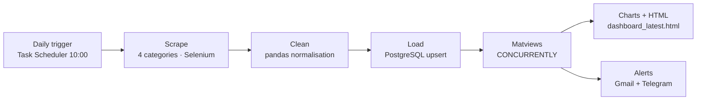
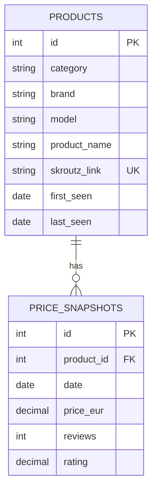
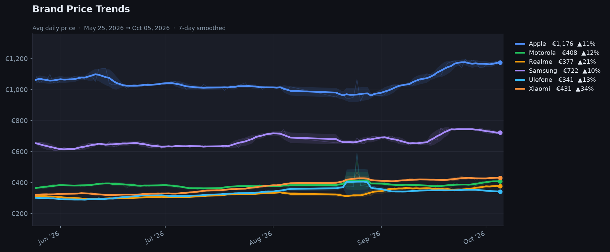
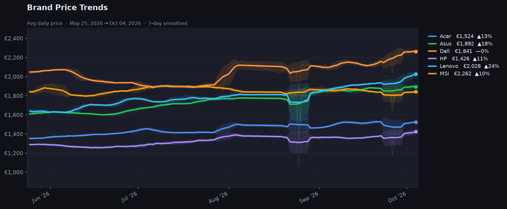
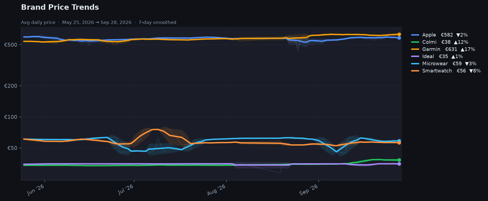
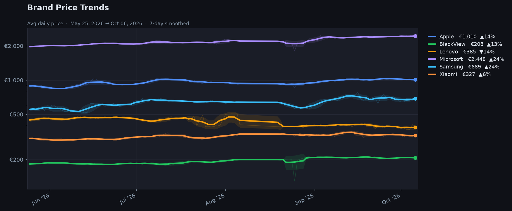

# Skroutz Price Tracker

**Live Dashboard (CV link):** [https://stavroskav.github.io/skroutz-data-pipeline/dashboard/dashboard_latest.html](https://stavroskav.github.io/skroutz-data-pipeline/dashboard/dashboard_latest.html)

[](https://github.com/StavrosKav/skroutz-data-pipeline/actions/workflows/ci.yml)
<!-- STATS:BADGES:START -->


<!-- STATS:BADGES:END -->


[](https://stavroskav.github.io/skroutz-data-pipeline/dashboard/dashboard_latest.html)

Production-style ETL pipeline that tracks every phone, laptop, tablet, and smartwatch on [Skroutz.gr](https://www.skroutz.gr) — Greece's largest e-commerce aggregator. It scrapes ~7k listings daily, upserts into PostgreSQL, refreshes analytics views, regenerates charts + a self-contained HTML dashboard, and alerts on price drops via Gmail and Telegram — unattended since mid-2025.

**Data story:** [What half a million snapshots reveal about Greek electronics pricing →](docs/INSIGHTS.md)

### Key findings

- **Most electronics listings barely last a year — smartwatches are the outlier.** Of phones tracked in June 2025, only 6.6% were still listed in July 2026 (laptops 11.2%, tablets 23.9%); smartwatches survived at 51.7%.
- **Discounting is brand culture.** Nothing cuts prices ≥3% on 6.9% of product-days — nearly 4× Apple's 1.6%.
- **Not every "sale" is a real deal.** Of 141 products cut ≥10% in summer sales week, only 27% hit a genuine new low.

---

## Architecture


```mermaid
flowchart LR
  A["Daily trigger\nTask Scheduler 10:00"] --> B["Scrape\n4 categories · Selenium"]
  B --> C["Clean\npandas normalisation"]
  C --> D["Load\nPostgreSQL upsert"]
  D --> E["Matviews\nCONCURRENTLY"]
  E --> F["Charts + HTML\ndashboard_latest.html"]
  E --> G["Alerts\nGmail + Telegram"]
```

Full stage graph, failure semantics, and ops notes: **[PIPELINE.md](docs/PIPELINE.md)**.

### Pipeline stages

| Stage | Script | Fatal? | What it does |
|---|---|---|---|
| 1 Scrape | `scrapers/run_all.py` → 4× Selenium | Yes | Parallel category scrapes → raw CSVs |
| 2 Health monitor | `ops/run_scraper_health.py` | No (observer) | Freshness / row-count checks on raw CSVs |
| 3 Clean | `etl/clean_all.py` | Yes | Brand/model/specs, Greek price formats |
| 4 Data quality | `ops/run_data_quality.py` | No (observer) | Schema / completeness / anomaly report |
| 5 Load | `etl/load_postgres.py` | Yes | Idempotent upsert → `products` + `price_snapshots` |
| Post | charts, dashboard, digests | No | PNG charts, `dashboard/dashboard_latest.html`, alerts |

Observers can fail without aborting the run or corrupting data. Any fatal-stage non-zero exit aborts immediately and fires Gmail + Telegram.

---

## Data model


```mermaid
erDiagram
  PRODUCTS {
    int id PK
    string category
    string brand
    string model
    string product_name
    string skroutz_link UK
    date first_seen
    date last_seen
  }
  PRICE_SNAPSHOTS {
    int id PK
    int product_id FK
    date date
    decimal price_eur
    int reviews
    decimal rating
  }
  PRODUCTS ||--o{ PRICE_SNAPSHOTS : "has"
```

`UNIQUE(product_id, date)` on `price_snapshots` makes every load re-run safe.

---

## Live market snapshot

<!-- STATS:TABLE:START -->
| Category | Products | Snapshots | Avg Price | Range | Brands |
|---|---|---|---|---|---|
| Laptop | 9,490 | 306,415 | €1,676 | €52–€11,863 | 47 |
| Phone | 6,366 | 166,883 | €336 | €9–€3,839 | 136 |
| Smartwatch | 6,862 | 341,182 | €91 | €4–€3,399 | — |
| Tablet | 1,959 | 60,075 | €558 | €31–€6,628 | 100 |
| **Total** | **24,677** | **874,555** | | | |

Updated daily via Task Scheduler · last pipeline run: 2026-10-06
<!-- STATS:TABLE:END -->

**Coverage:** Two-week baseline in June 2025, then unattended daily runs from 2026-05-25.

---

## Price trend charts

Average daily price for the 6 largest brands per category (7-day smoothed) — regenerated after every run by `reporting/charts_from_db.py`.

**Phones**


**Laptops**


**Smartwatches**


**Tablets**


Live interactive report: **[dashboard_latest.html](https://stavroskav.github.io/skroutz-data-pipeline/dashboard/dashboard_latest.html)** (also linked from the repo root Pages redirect).

---

## Engineering highlights

- **Observer-stage design** — charts, alerts, dashboard, and README stats are non-fatal; contract pinned by tests (`run_pipeline.py`, `tests/test_smoke.py`).
- **Markup-drift guard** — per-field completeness thresholds before CSV write; fixture canary on real listing HTML (`scrapers/scraper_core.py`, `tests/test_pipeline.py`).
- **Alerting below the app layer** — PowerShell wrapper can Telegram-alert even if Python fails to start (`run_pipeline_wrapper.ps1`).
- **Idempotent loads** — upserts + stale-aware lock file; safe to re-run.
- **Materialized analytics** — 10 of 15 views refreshed `CONCURRENTLY`; pg_trgm for Telegram `/find`.
- **CI on every push** — ruff, pytest, pip-audit, TruffleHog (+ nightly schedule).

---

## Tech stack

| Layer | Technology |
|---|---|
| Scraping | Python 3.12 · Selenium · undetected-chromedriver |
| Processing | pandas · numpy |
| Database | PostgreSQL 17 · SQLAlchemy 2.x |
| Analytics | 15 SQL views · window functions · materialized views |
| Dashboards | Self-contained HTML (Chart.js) · Streamlit |
| Alerts | Gmail SMTP · Telegram Bot API |
| Ops | Docker (Clean+Load) · Windows Task Scheduler · GitHub Actions |

---

## Project layout

```
skroutz-data-pipeline/
├── run_pipeline.py / .bat / _wrapper.ps1   # orchestrator + scheduler entry
├── core/                                   # paths.py, db.py
├── scrapers/                               # scraper_core, phones|laptops|tablets|smartwatches, run_all
├── etl/                                    # clean_common, clean_*, clean_all, load_postgres
├── reporting/                              # generate_dashboard, charts_from_db, queries, streamlit_app
├── alerts/                                 # notifications, telegram_*, nim_*
├── ops/                                    # run_data_quality, run_scraper_health
├── sql/                                    # create_new_schema.sql, analytics.sql
├── dashboard/dashboard_latest.html         # GitHub Pages artifact (CV URL)
├── charts/price_trend_*.png
├── index.html                              # Pages redirect → dashboard/dashboard_latest.html
├── config/ · agents/ · migrations/ · tests/
├── docs/PIPELINE.md · docs/INSIGHTS.md
└── Phones|Laptops|Tablets|Smartwatches_skroutz/ · Clean/   # gitignored CSVs
```

---

## Run locally (high level)

1. **Python 3.12 + venv** — `pip install -r requirements.txt`
2. **Configure** — copy `.env.example` → `.env` (DB_*, optional Gmail / Telegram)
3. **Schema once** — `sql/create_new_schema.sql` then `sql/analytics.sql`
4. **Full pipeline** — `python run_pipeline.py` (or `run_pipeline.bat` on Windows)
5. **Optional** — `streamlit run reporting/streamlit_app.py` · `python -m alerts.telegram_bot`
6. **Quality** — `pytest tests/ -v` · `ruff check .`

Scrapers need a real Chrome window (headless is blocked). Docker covers Clean + Load only (`SKIP_SCRAPE=1` in `docker-compose.yml`). Details: [PIPELINE.md](docs/PIPELINE.md).

---

## Alerts & Telegram

| Alert | Channel |
|---|---|
| Daily top drops · watchlist hits · disappeared products | Gmail + Telegram |
| Pipeline success / failure | Gmail + Telegram |
| Interactive queries (`/drops`, `/find`, `/history`, `/watchlist`, …) | Telegram bot |

---

## Scope & compliance

- Only four public category listing pages (`/c/40/`, `/c/25/`, `/c/1105/`, `/c/1705/`) — not disallowed by [robots.txt](https://www.skroutz.gr/robots.txt) for `User-agent: *`.
- Never hits disallowed paths (`/api/`, `/users/`, `/cart/`, `/checkout/`).
- No login, no personal data — public listings only; ~1.2–3s pauses between page loads.
- No raw CSVs in git; published dashboard is aggregated stats + a bounded sample of listings.

> Personal learning / portfolio project. MIT licensed.
