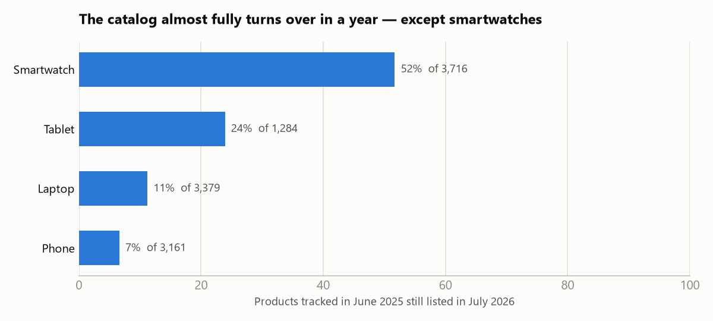
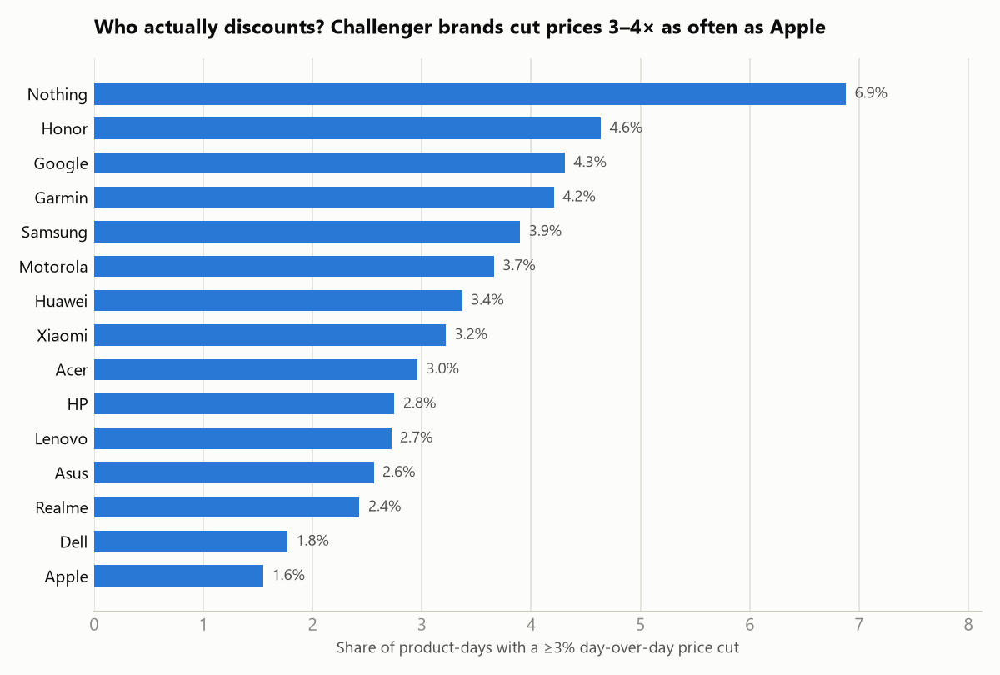
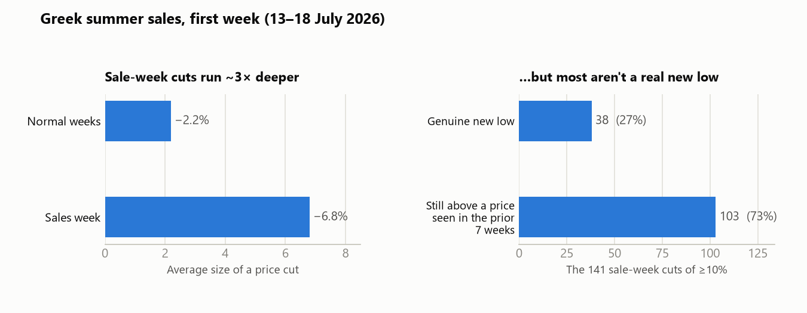

# What 460,000 price snapshots reveal about Greek electronics pricing

*Findings from the [Skroutz Price Tracker](../README.md) database — 459,737 price snapshots of 21,501 products (phones, laptops, tablets, smartwatches) on Skroutz.gr, collected between 10 June 2025 and 18 July 2026. Every number below comes from a SQL query against the live PostgreSQL database; the queries are included at the end. Generated 2026-07-18.*

**About the data window:** the tracker captured a two-week baseline in June 2025, then has run daily since 25 May 2026 (46 run-days through 18 July; the few missed days are excluded from all day-over-day stats by the consecutive-day filter). That gap is disclosed everywhere it matters below — but it also enables the most interesting finding here: a same-product, one-year-apart price comparison.

---

## 1. An electronics listing barely lives a year — unless it's a smartwatch

Of the 3,161 phones tracked in June 2025, only **6.6%** were still listed on Skroutz in July 2026. Laptops: **11.2%** of 3,379. Tablets: **23.9%** of 1,284. Smartwatches are the outlier — **51.7%** of 3,716 survived the year.



Phone and laptop catalogs turn over almost completely within 13 months as models are superseded and delisted; smartwatch listings live roughly 5–8× longer. The practical consequence: **price history for a phone dies with its listing**. By the time you're deciding whether a "deal" is real, the public record of what it used to cost is usually gone — which is exactly the gap a longitudinal tracker fills.

## 2. Prices are sticky — and falls behave differently from rises

Across 377,987 consecutive-day observations, a product's price is **unchanged 79.0% of the time**. When it does move, drops are slightly more frequent than rises (11.0% vs 10.0% of observations) but much smaller: the **average drop is −2.4%** (median −0.2%) while the **average rise is +3.4%**.

The texture of pricing on Greece's largest marketplace: retailers shave prices often and quietly, then re-rack them upward in larger, rarer jumps.

## 3. Discounting is brand culture: Nothing cuts prices 4× as often as Apple

For each brand, the share of product-days with a day-over-day cut of ≥3%:



Challenger phone brands discount constantly — **Nothing (6.9%), Honor (4.6%), Google (4.3%)** — while **Apple sits at 1.6%**, the lowest of the ten biggest brands in the catalog (only a handful of small accessory-tier brands sit lower), with its prices completely unchanged on 82.7% of product-days (Samsung: 63.6%). Garmin (4.2%) is the discounting outlier in wearables. If you're waiting for an Apple product to drop, the data says: that's mostly not a thing.

## 4. Summer sales week: cuts run 3× deeper — but 73% aren't a real new low

Greek summer sales started Monday 13 July 2026. In the first week, the average price cut was **−6.8%, versus −2.2%** in the preceding six weeks — retailers switch from small adjustments to headline discounts.

But depth isn't honesty. Of the **141 products cut by ≥10%** during sales week, only **38 (27%)** landed at a genuine new low. The other **103 (73%) were still priced above a level you could have paid at some point in the previous seven weeks** — a discount from an inflated reference point, not a bargain.

That 73% is specific to the ≥10% threshold, and the pattern is not monotonic: among the very deepest cuts (≥12%), the majority — 30 of 48 (62%) — *did* set a genuine new low. The inflated-reference effect concentrates in the headline-friendly 10–12% band, where 91% of cuts stayed above a recent price.



*(Based on the sale days with a directly comparable previous day; the biggest verified single cuts of the week include an HP 15-fc0041ny at −36% and a Microsoft Surface Pro 11 at −34.5%.)*

## 5. A year later, the same product costs… about the same

For products listed in both June 2025 and June 2026, the median price change over the year was **−2.7% for laptops** (56.5% of 370 models got cheaper), **−0.6% for phones**, **−0.1% for tablets**, and **0.0% for smartwatches**.

The daily churn of small cuts and larger rises (finding 2) nets out to almost nothing: for the products that survive, electronics don't meaningfully depreciate on the shelf — depreciation happens by *replacement* (finding 1), not by markdown. Related: across 18,630 disappear-and-return events (a listing absent for 3+ days, then back) during the continuous 2026 run, the median price change on return was exactly **0.0%** — and it stays 0.0% however the gap window is sliced.

---

## Method notes

- **Day-over-day statistics use consecutive-day pairs only** (`LAG(date) = date − 1`), so the June 2025 → May 2026 coverage gap and occasional missed days never masquerade as price changes.
- "Discount rate" = share of a brand's product-day observations with a cut of ≥3% vs the previous day; brands shown have ≥30 tracked products.
- Survival (finding 1) = product had at least one snapshot between 10–23 June 2025 **and** at least one on/after 18 June 2026. A product that merely changed its Skroutz listing ID counts as churned — the number measures listing survival, not model availability.
- Sales-week analysis covers 13–18 July 2026 against a 1 June – 12 July 2026 baseline; "genuine new low" compares each sale price against the product's minimum over 25 May – 12 July 2026. Early-window caveat: only the sale days with a directly comparable previous day enter the depth statistic.
- The year-over-year comparison (finding 5) uses each product's average price over 10–23 June 2025 vs 10–23 June 2026 and is conditioned on survival — the 6–52% of products that survived (finding 1) are plausibly the steadier ones.
- Disappear-and-return events (finding 5) count snapshot gaps of ≥3 days within the continuous 2026 run only, so the tracker's own 2025→2026 coverage gap never counts as a "restock"; a gap is a proxy for out-of-stock, not proof of it.

<details>
<summary><strong>The SQL behind the numbers</strong></summary>

All queries run against two tables — `products` and `price_snapshots` (UNIQUE on `product_id, date`) — plus the analytics views in [analytics.sql](../analytics.sql). The consecutive-pair base used throughout:

```sql
WITH ph AS (
  SELECT product_id, date, price_eur,
         LAG(price_eur) OVER (PARTITION BY product_id ORDER BY date) AS prev,
         LAG(date)      OVER (PARTITION BY product_id ORDER BY date) AS prev_date
  FROM price_snapshots
)
SELECT ... FROM ph
WHERE prev IS NOT NULL AND prev > 0 AND prev_date = date - 1
```

Survival by category (finding 1):

```sql
WITH p25 AS (
  SELECT DISTINCT product_id FROM price_snapshots
  WHERE date BETWEEN '2025-06-10' AND '2025-06-23'
),
recent AS (
  SELECT DISTINCT product_id FROM price_snapshots WHERE date >= '2026-06-18'
)
SELECT p.category,
       COUNT(*)                                   AS tracked_jun_2025,
       ROUND(100.0 * COUNT(r.product_id) / COUNT(*), 1) AS survival_pct
FROM p25
JOIN products p ON p.id = p25.product_id
LEFT JOIN recent r ON r.product_id = p25.product_id
GROUP BY p.category;
```

Genuine-new-low check (finding 4):

```sql
WITH sale AS (
  SELECT product_id, MIN(price_eur) AS sale_price
  FROM ph                     -- consecutive-pair base above
  WHERE date BETWEEN '2026-07-13' AND '2026-07-18'
    AND 100.0 * (price_eur - prev) / prev <= -10
  GROUP BY product_id
),
prior_low AS (
  SELECT product_id, MIN(price_eur) AS low_before
  FROM price_snapshots
  WHERE date BETWEEN '2026-05-25' AND '2026-07-12'
  GROUP BY product_id
)
SELECT COUNT(*)                                              AS deals,
       COUNT(*) FILTER (WHERE s.sale_price >  p.low_before)  AS not_a_new_low,
       COUNT(*) FILTER (WHERE s.sale_price <= p.low_before)  AS genuine_new_low
FROM sale s JOIN prior_low p USING (product_id);
```

Brand discount rate (finding 3):

```sql
SELECT p.brand,
       COUNT(DISTINCT ph.product_id) AS n_products,
       ROUND(100.0 * COUNT(*) FILTER (
         WHERE 100.0 * (price_eur - prev) / prev <= -3) / COUNT(*), 2) AS disc_rate_pct
FROM ph JOIN products p ON p.id = ph.product_id
WHERE prev IS NOT NULL AND prev > 0 AND prev_date = date - 1
GROUP BY p.brand
HAVING COUNT(DISTINCT ph.product_id) >= 30
ORDER BY disc_rate_pct DESC;
```

</details>
